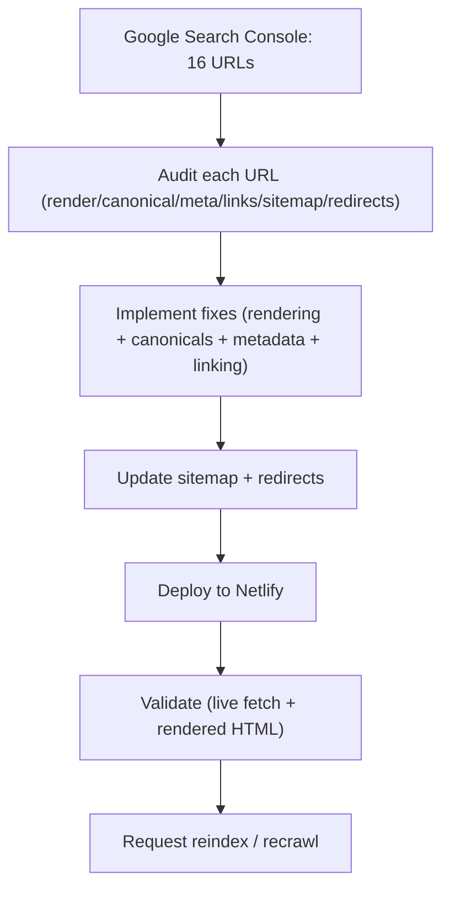

## 1. Product Overview
WhyClaimDenied is a React + Netlify content site for insurance-claim denial education.
This initiative fixes “Crawled – currently not indexed” by improving initial renderability, canonical consistency, metadata uniqueness, internal linking, sitemap hygiene, and redirect rules.

## 2. Core Features

### 2.1 Feature Module
Our requirements consist of the following main pages:
1. **Public Content Pages (existing site pages)**: ensure Google can render meaningful HTML, see correct canonical, and find unique metadata.
2. **SEO System Endpoints (robots + sitemap)**: ensure crawl directives and discovery signals are correct and consistent.
3. **Redirect + Canonical Governance (Netlify rules)**: ensure one clean URL per page, with minimal redirect chains.

### 2.2 Page Details
| Page Name | Module Name | Feature description |
|---|---|---|
| Public Content Pages (Home, Guides, State hubs, Denial reasons, Blog, About/Contact/Legal) | Rendering / indexability | Serve crawlable first-response HTML that includes: H1, main body copy, internal links, and page-level metadata without relying on client JS execution. |
| Public Content Pages | Canonical consistency | Emit a single self-referential canonical per page matching the preferred hostname/protocol and URL format; ensure internal links use the canonical URL format. |
| Public Content Pages | Metadata uniqueness | Generate unique `<title>` + meta description per URL; prevent duplicates caused by shared templates or incorrect “home” metadata mapping. |
| Public Content Pages | Internal linking | Add contextual links: hubs → children, children → hub, and cross-links to related guides/reasons; ensure every important URL is linked from at least one indexable hub. |
| SEO System Endpoints | Sitemap accuracy | Include only canonical URLs; ensure all important routes appear once; keep `lastmod` updated; remove non-canonical/redirecting URLs. |
| SEO System Endpoints | Robots alignment | Keep `robots.txt` permissive for public pages; confirm sitemap URL matches the canonical hostname and protocol. |
| Redirect + Canonical Governance | Netlify redirect rules | Enforce: http→https, www→non-www (or your chosen standard), trailing-slash policy, and legacy slug 301s; avoid redirect chains; avoid serving multiple URL variants as 200. |
| QA / SEO Audit | 16-URL audit worksheet | For each provided URL, record: fetch status, rendered HTML check, canonical, meta uniqueness, internal links, sitemap presence, redirect chain, and final recommended action. |

## 3. Core Process
**SEO fix flow (operator):** Export the “Crawled – currently not indexed” URL list (16 URLs) → run the audit checklist per URL → classify root cause (rendering, canonical, duplication, internal linking, redirect, sitemap) → implement fixes → validate with live fetch + rendered HTML inspection → deploy → request reindex in Google Search Console.

**Googlebot flow (after fixes):** Google discovers URL via internal links/sitemap → fetches HTML → sees unique title/description + self canonical → finds content and internal links in HTML → crawls deeper URLs → indexes canonical.

### Appendix A — 16-URL Audit Worksheet
Paste your 16 URLs into the table and fill findings per row.

| # | URL | Current status (GSC) | Findings (render/canonical/meta/links/sitemap/redirect) | Fix | Validation steps | Priority |
|---:|---|---|---|---|---|---|
| 1 |  | Crawled – currently not indexed |  |  |  |  |
| 2 |  | Crawled – currently not indexed |  |  |  |  |
| 3 |  | Crawled – currently not indexed |  |  |  |  |
| 4 |  | Crawled – currently not indexed |  |  |  |  |
| 5 |  | Crawled – currently not indexed |  |  |  |  |
| 6 |  | Crawled – currently not indexed |  |  |  |  |
| 7 |  | Crawled – currently not indexed |  |  |  |  |
| 8 |  | Crawled – currently not indexed |  |  |  |  |
| 9 |  | Crawled – currently not indexed |  |  |  |  |
| 10 |  | Crawled – currently not indexed |  |  |  |  |
| 11 |  | Crawled – currently not indexed |  |  |  |  |
| 12 |  | Crawled – currently not indexed |  |  |  |  |
| 13 |  | Crawled – currently not indexed |  |  |  |  |
| 14 |  | Crawled – currently not indexed |  |  |  |  |
| 15 |  | Crawled – currently not indexed |  |  |  |  |
| 16 |  | Crawled – currently not indexed |  |  |  |  |
