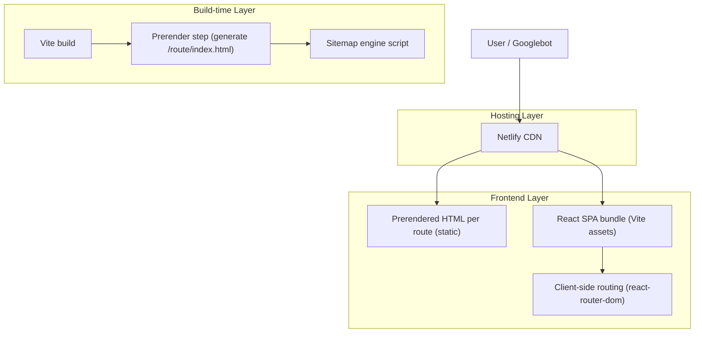

## 1.Architecture design

## 2.Technology Description
- Frontend: React@18 + react-router-dom@6 + react-helmet-async@2 + Vite@6
- Backend: None
- Hosting: Netlify (static hosting + redirects)
- Build utilities (existing): Node scripts for sitemap and redirect generation

## 3.Route definitions
| Route | Purpose |
|---|---|
| / | Home page (must have its own canonical + unique metadata) |
| /guides | Guides hub / index |
| /guides/:slug | Guide detail |
| /auto-insurance-claims-denied-:state | Auto state hub |
| /auto-insurance-claims-denied-:state/:reason | Auto denial reason detail |
| /health-insurance-claims-denied-:state | Health state hub |
| /health-insurance-claims-denied-:state/:reason | Health denial reason detail |
| /blog | Blog index |
| /blog/:state | Blog state index |
| /blog/:state/:slug | Blog post |
| /about, /contact, /privacy, /terms | Utility pages |
| /sitemap.xml | Sitemap endpoint (static file generated postbuild) |
| /robots.txt | Robots endpoint |

## 4.API definitions (If it includes backend services)
N/A (no backend required).

## 6.Data model(if applicable)
N/A (static content site).

### Implementation notes (key to “crawled not indexed”)
1) **Prerendering / rendering improvements**
- Goal: for each important route, the first HTML response should include: title/description/canonical, H1, and meaningful body content.
- Approach: add a build-time prerender step that enumerates canonical routes (from your router registry / sitemap list) and writes `dist/<route>/index.html`.
- Keep client hydration so UX remains SPA-fast.

2) **Canonical + redirect alignment**
- Choose one standard: `https://whyclaimdenied.com/<path>` (non-www) with a single trailing-slash policy.
- Update Netlify `_redirects` to 301 all alternate variants to the canonical (avoid chains).
- Ensure your Helmet canonical matches the final URL after redirects.

3) **Metadata uniqueness guardrails**
- Add a build-time check that fails build if two routes share the same canonical OR if title/description are missing.
- Specifically confirm `/` is not accidentally using a different page’s canonical/title.

4) **Sitemap hygiene**
- Ensure sitemap contains only canonical URLs that resolve as 200 without redirect.
- Ensure the sitemap excludes any URL variants that rely on Netlify 301s.
