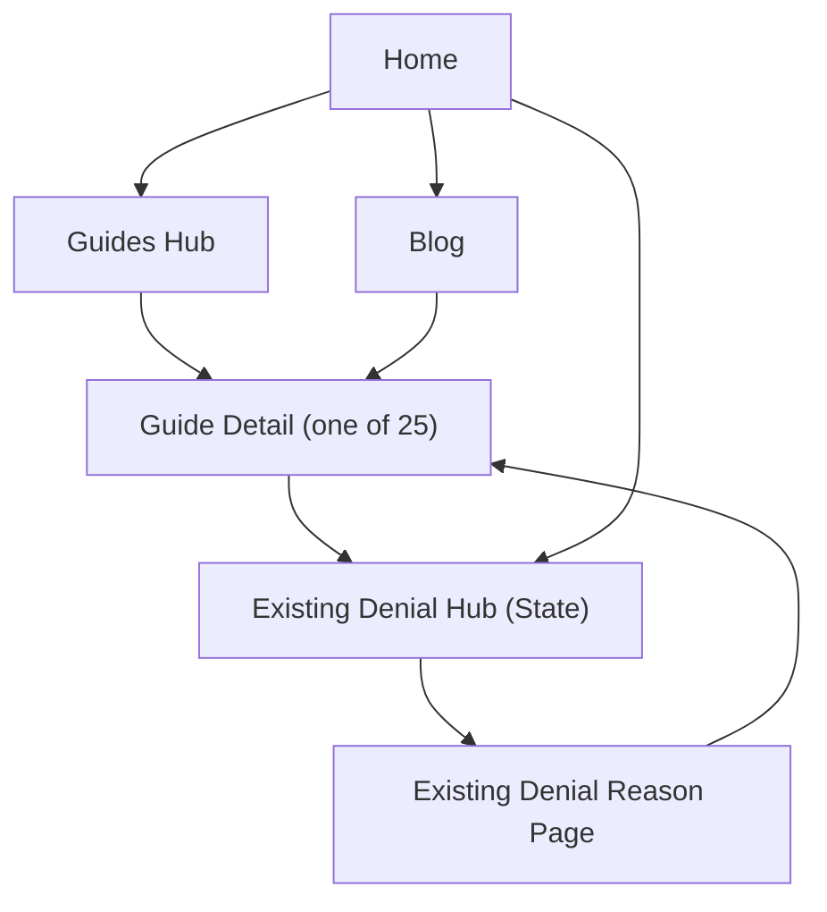

## 1. Product Overview
WhyClaimDenied is a content-first website that helps people understand why insurance claims are denied and what to do next.
This initiative adds 25 high-intent “Guides” pages and makes Guides the primary internal-linking hub, while keeping all existing routes and canonicals stable.

## 2. Core Features

### 2.1 Feature Module
Our requirements consist of the following main pages:
1. **Home**: primary navigation with Guides as a top-level entry point, curated guide cards, links to existing state denial hubs.
2. **Guides (Index / Hub)**: browse and search-like filtering (simple client-side filter) across 25 guides, category sections, featured “Start here” path.
3. **Guide (Detail)**: long-form guide content with FAQ + breadcrumb schema, prominent next-step links into relevant state denial hubs.
4. **Existing Denial Pages (State hubs + denial reasons)**: unchanged URLs; add “Related Guides” module and adjust internal links so guides are the primary next-step.
5. **Blog (existing)**: keep routes; add contextual “Related Guides” links where applicable.

### 2.2 Page Details
| Page Name | Module Name | Feature description |
|---|---|---|
| Home | Guides-first navigation | Promote “Guides” in header/nav and homepage hero; keep existing links available. |
| Home | Curated internal linking | Link to Guides hub and top 6–8 guides; keep links to state denial hubs. |
| Guides (Index / Hub) | Guide list + filter | List 25 guide cards; filter by claim type (Auto/Health), denial topic, and “Immediate next step”. |
| Guides (Index / Hub) | SEO entry point | Render unique title/description/canonical; expose crawlable links to all 25 guides. |
| Guide (Detail) | Guide content template | Explain the topic; include action checklist and “What to do next” section that links deeper into relevant existing pages. |
| Guide (Detail) | FAQ + schema | Display FAQs and emit FAQPage JSON-LD; include BreadcrumbList JSON-LD. |
| Guide (Detail) | Canonical safety | Emit self-referential canonical for new guides; do not alter canonicals of existing routes. |
| Sitemap / SEO | Sitemap completeness | Ensure all 25 guide canonicals are included in the generated sitemap without changing existing entries. |
| Sitemap / SEO | Safe schema rollout | Add schema only where valid (Guide detail pages first); ensure no duplicate/contradicting JSON-LD blocks per page. |

### 2.3 Guide List (25 pages)
All guides live under **/guides/{slug}**:
1) /guides/what-to-do-after-a-claim-denial
2) /guides/how-to-write-an-insurance-appeal-letter
3) /guides/how-to-read-an-eob-or-denial-letter
4) /guides/appeal-deadlines-and-timelines
5) /guides/appeal-documentation-checklist
6) /guides/request-your-insurance-claim-file
7) /guides/health-claim-denied-prior-authorization
8) /guides/health-claim-denied-not-medically-necessary
9) /guides/health-claim-denied-out-of-network
10) /guides/health-claim-denied-coding-or-documentation
11) /guides/health-claim-denied-timely-filing
12) /guides/health-claim-denied-coordination-of-benefits
13) /guides/health-claim-denied-pre-existing-condition
14) /guides/health-insurance-external-review
15) /guides/file-a-complaint-with-your-state-insurance-department
16) /guides/insurance-bad-faith-basics
17) /guides/auto-claim-denied-no-coverage-at-time-of-loss
18) /guides/auto-claim-denied-policy-lapse-or-cancellation
19) /guides/auto-claim-denied-late-notice-or-missed-deadline
20) /guides/auto-claim-denied-excluded-driver
21) /guides/auto-claim-denied-misrepresentation-or-concealment
22) /guides/auto-claim-denied-non-covered-use
23) /guides/auto-claim-denied-failure-to-cooperate
24) /guides/auto-claim-denied-disputed-liability
25) /guides/when-to-consider-small-claims-court-for-insurance

## 3. Core Process
**Visitor flow (Guides-first):** You land on Home or a denial page from search → you click into a relevant Guide → you follow “What to do next” links into the most relevant existing state hub / denial reason page → you continue to deeper guides as needed.

