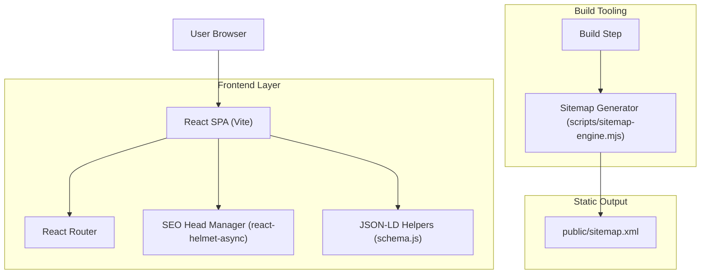

## 1.Architecture design

## 2.Technology Description
- Frontend: React@18 + react-router-dom@6 + react-helmet-async@2 + Vite@6
- Backend: None (static SPA)

## 3.Route definitions
| Route | Purpose |
|---|---|
| / | Home page; primary entry points with Guides as top nav. |
| /guides | Guides hub; crawlable list of 25 guides. |
| /guides/:slug | Guide detail page (25 concrete slugs); guide content + FAQ/breadcrumb schema. |
| /blog | Blog index (existing). |
| /blog/:state | Blog state index (existing). |
| /blog/:state/:slug | Blog post (existing). |
| /auto-insurance-claims-denied-{state} | Existing auto denial hub pages (do not rename). |
| /auto-insurance-claims-denied-{state}/{reason} | Existing auto denial reason pages (do not rename). |
| /health-insurance-claims-denied-{state} | Existing health denial hub pages (do not rename). |
| /health-insurance-claims-denied-{state}/{reason} | Existing health denial reason pages (do not rename). |
| /about, /contact, /privacy, /terms | Static pages (existing). |

## 4.API definitions (If it includes backend services)
N/A

## 6.Data model(if applicable)
N/A

### SEO + Sitemap safety requirements (implementation notes)
- **Do not change existing route paths** in the router; add only new /guides routes.
- **Do not change existing canonical URLs** already defined; only add canonicals for new guide pages.
- **Sitemap generation** currently sources URLs from META canonicals + blog registry + denials registry + prior sitemap. Add Guides canonicals via a dedicated Guides registry or META entries so they are included deterministically.
- **Sitemap ordering**: update sitemap build ordering to place /guides and /guides/* immediately after root pages, keeping existing ordering intact.
- **Canonical validation**: guide slugs must be lowercase kebab-case and match sitemap validation (no uppercase, no query/hash).