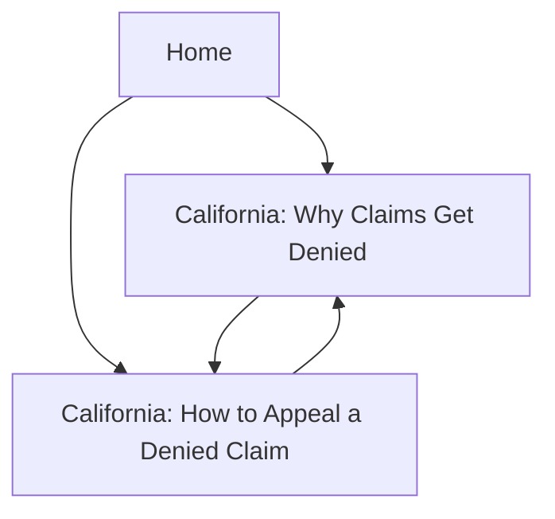

## 1. Product Overview

WhyClaimDenied is an SEO-optimized static website that explains why insurance claims get denied and what to do next.
It targets California users with clear guidance pages, FAQ content, and search-friendly structured data.

## 2. Core Features

### 2.1 Feature Module

Our site requirements consist of the following main pages:

1. **Home**: primary navigation, value proposition, entry points to California pages, trust/credibility content.
2. **California: Why Claims Get Denied**: long-form guide content, FAQ section with FAQ schema, contextual CTAs.
3. **California: How to Appeal a Denied Claim**: step-by-step appeal guidance, checklist-style content, FAQ section with FAQ schema.

### 2.2 Page Details

| Page Name                                | Module Name           | Feature description                                                                             |
| ---------------------------------------- | --------------------- | ----------------------------------------------------------------------------------------------- |
| Home                                     | Header + Navigation   | Show site name/logo and links to the two California pages.                                      |
| Home                                     | Hero                  | Explain the site purpose in one sentence and present two primary CTA buttons (to each CA page). |
| Home                                     | Featured links        | Present cards linking to the two California pages with short summaries.                         |
| Home                                     | SEO meta              | Render reusable title/description/canonical and OpenGraph/Twitter metadata.                     |
| Home                                     | Footer                | Show basic site links and disclaimer text.                                                      |
| California: Why Claims Get Denied        | Page header           | Show title, last-updated date (optional), and short intro summary.                              |
| California: Why Claims Get Denied        | Content sections      | Explain common denial reasons and what evidence to gather.                                      |
| California: Why Claims Get Denied        | FAQ                   | Display FAQs and emit FAQPage JSON-LD via reusable schema system.                               |
| California: Why Claims Get Denied        | Internal linking      | Link to the California appeal page and back to Home using crawlable links.                      |
| California: Why Claims Get Denied        | SEO meta              | Render reusable title/description/canonical and OpenGraph/Twitter metadata.                     |
| California: How to Appeal a Denied Claim | Page header           | Show title and short intro summary.                                                             |
| California: How to Appeal a Denied Claim | Step-by-step guidance | Provide ordered steps, timelines guidance, and what to submit.                                  |
| California: How to Appeal a Denied Claim | Checklist             | Provide a scannable checklist users can follow before submitting an appeal.                     |
| California: How to Appeal a Denied Claim | FAQ                   | Display FAQs and emit FAQPage JSON-LD via reusable schema system.                               |
| California: How to Appeal a Denied Claim | Internal linking      | Link to the denial reasons page and back to Home using crawlable links.                         |
| California: How to Appeal a Denied Claim | SEO meta              | Render reusable title/description/canonical and OpenGraph/Twitter metadata.                     |

## 3. Core Process

* Visitor lands on Home from search or direct.

* Visitor selects one of the two California pages based on intent (reasons vs. appeal).

* Visitor reads the guide, uses FAQ, and follows internal links to the other California page for the next step.

